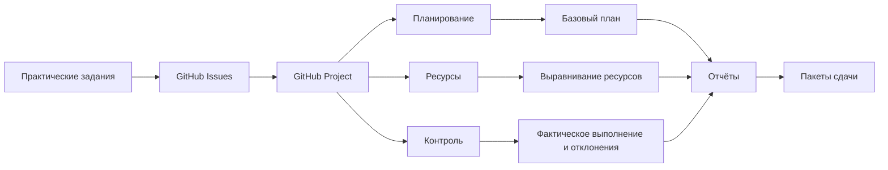
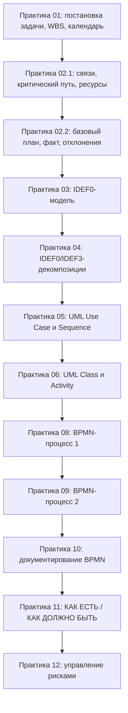
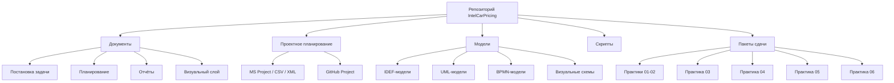
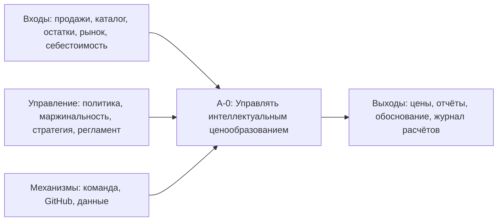

# IntelCarPricing

**Проект:** Интеллектуальное ценообразование на автомобильную продукцию  
**Дисциплина:** Управление проектами  
**Автор:** Облов Андрей Андреевич, СИИ-23, 3 курс, РАНХиГС ЭМИТ

## Назначение репозитория

Репозиторий используется как Git-ориентированная среда управления учебным проектом.

Основная исследовательская позиция проекта: Git/GitHub рассматривается как самодостаточный интерфейс ведения проектной деятельности, включая документацию, планирование, задачи, статусы, диаграммы, риски, отчёты, историю изменений и воспроизводимые артефакты.

## Ключевые документы

- `docs/assignment-map.md` — карта соответствия практических заданий и Git-артефактов.
- `PROJECT_CHARTER.md` — паспорт проекта.
- `docs/problem-statement/statement.md` — постановка задачи.
- `docs/planning/work-breakdown-structure.md` — иерархическая структура работ.
- `project/github-project/fields.md` — проектные поля GitHub Projects.
- `project/github-project/labels.md` — система labels.
- `project/github-project/milestones.md` — система milestones.

## Принцип работы

Исходные артефакты хранятся в открытых или текстовых форматах: Markdown, CSV, XML, PlantUML, BPMN XML, Draw.io XML.

Бинарные файлы DOCX, XLSX, PPTX, MPP, BPM допускаются как производные или совместимые форматы сдачи.

<!-- VISUAL_DASHBOARD_START -->

## Визуальная панель проекта

Проект: **Интеллектуальное ценообразование на автомобильную продукцию**

### Управленческий контур

### Дорожная карта

### Структура репозитория

### IDEF0-контекст

Подробнее: [`docs/visuals/project-dashboard.md`](docs/visuals/project-dashboard.md)

<!-- VISUAL_DASHBOARD_END -->
