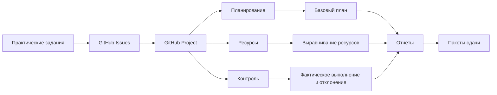

# Единая презентация проекта

## 1. Титульный слайд

**Проект:** Интеллектуальное ценообразование на автомобильную продукцию  
**Дисциплина:** Управление проектами  
**Автор:** Облов Андрей Андреевич, СИИ-23, 3 курс, РАНХиГС ЭМИТ

## 2. Назначение проекта

Цель проекта — сформировать управляемую систему подготовки рекомендованных цен на автомобильную продукцию на основе данных о продажах, каталоге, остатках, рынке, себестоимости и ограничениях маржинальности.

Проект ведётся в GitHub как единой среде управления: документация, задачи, статусы, диаграммы, планы, отчёты и проверяемые артефакты находятся в репозитории.

## 3. Карта выполнения практических работ

| Практика | Результат | Основной путь |
|---|---|---|
| 01 | Постановка задачи, календарь, ресурсы, WBS | `docs/problem-statement`, `docs/planning` |
| 02.1 | Связи задач, критический путь, ресурсное выравнивание | `project/msproject/exports` |
| 02.2 | Базовый план, фактические данные, отклонения, отчёты | `docs/reports/project-management-reports` |
| 03 | Функциональная модель IDEF0 | `models/idef/practice-03` |
| 04 | Декомпозиционные IDEF0/IDEF3 диаграммы | `models/idef/practice-04` |
| 05 | UML Use Case и Sequence | `models/uml/practice-05` |
| 06 | UML Class и Activity | `models/uml/practice-06` |
| 08 | Первый BPMN-процесс | `models/bpmn/practice-08` |
| 09 | Второй BPMN-процесс | `models/bpmn/practice-09` |
| 10 | Документирование BPMN | `docs/reports/practice-10-business-process-report.md` |

## 4. Управленческий контур

## 5. Постановка задачи

Постановка задачи определяет предметную область, цели, ограничения, заинтересованные стороны и ожидаемый результат проекта.

Ключевые документы:

- `PROJECT_CHARTER.md`;
- `docs/problem-statement/statement.md`;
- `docs/assignment-map.md`.

## 6. Планирование проекта

Планирование включает WBS, календарь, ресурсы, ограничения, длительности задач, зависимости, критический путь и базовый план.

Ключевые артефакты:

- `docs/planning/work-breakdown-structure.md`;
- `docs/planning/calendar.md`;
- `docs/planning/constraints.md`;
- `project/msproject/IntelCarPricing.xml`;
- `project/msproject/exports/tasks.csv`;
- `project/msproject/exports/resources.csv`.

## 7. Контроль исполнения

Для контроля используются базовые и фактические показатели, отклонения по длительности и стоимости, отчёты по затратам и освоенному объёму.

Ключевые отчёты:

- `docs/reports/practice-02-part-2-report.md`;
- `docs/reports/project-management-reports/project-overview.md`;
- `docs/reports/project-management-reports/task-cost-overview.md`;
- `docs/reports/project-management-reports/earned-value-report.md`;
- `docs/reports/project-management-reports/resource-cost-overview.md`;
- `docs/reports/project-management-reports/cash-flow.md`.

## 8. Функциональное моделирование IDEF

IDEF-модели описывают функции управления интеллектуальным ценообразованием, входы, управления, механизмы и выходы.

Ключевые артефакты:

- `models/idef/practice-03/idef0-functional-model.md`;
- `models/idef/practice-03/A-0-context.mmd`;
- `models/idef/practice-03/A0-decomposition.mmd`;
- `models/idef/practice-04/A3-idef3-price-recommendation.mmd`;
- `models/idef/practice-04/A4-idef0-approval-decomposition.mmd`.

## 9. UML-моделирование

UML-модели фиксируют функциональное взаимодействие пользователей и системы, последовательность расчёта цены, классовую структуру и процесс согласования.

Ключевые артефакты:

- `models/uml/practice-05/use-case-diagram.puml`;
- `models/uml/practice-05/sequence-price-recommendation.puml`;
- `models/uml/practice-06/class-diagram.puml`;
- `models/uml/practice-06/activity-price-approval.puml`.

## 10. BPMN-моделирование

Практики 08 и 09 описывают два связанных бизнес-процесса:

1. формирование рекомендованной цены;
2. согласование и публикация цены.

Ключевые артефакты:

- `models/bpmn/practice-08/price-recommendation-process.mmd`;
- `models/bpmn/practice-08/price-recommendation-process.bpmn`;
- `models/bpmn/practice-09/price-approval-publication-process.mmd`;
- `models/bpmn/practice-09/price-approval-publication-process.bpmn`.

## 11. Документирование BPMN

Практика 10 документирует BPMN-процесс формирования рекомендованной цены: участники, задачи, данные, контрольные точки, структура данных и проверка выполнения требований.

Ключевые артефакты:

- `docs/reports/practice-10-business-process-report.md`;
- `docs/reports/practice-10-business-process-documentation.csv`;
- `models/bpmn/practice-08/process-documentation.md`;
- `models/bpmn/practice-08/element-count.csv`;
- `models/bpmn/practice-08/validation-report.md`.

## 12. Трассируемость

Каждый результат связан с практической работой, GitHub Issue, путём в репозитории и отчётом. Основной индекс проверки находится в файле:

`docs/presentation/artifact-index.csv`

## 13. Итоговая готовность

Проект демонстрирует полный цикл учебного управления проектом:

- инициация и постановка задачи;
- календарное и ресурсное планирование;
- базовый план и контроль исполнения;
- функциональное моделирование;
- UML-моделирование;
- BPMN-моделирование;
- документирование бизнес-процесса;
- GitHub как единая среда управления и сдачи.
