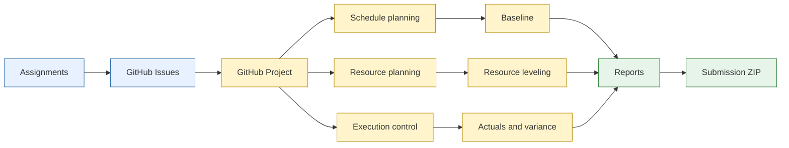
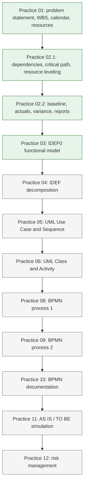
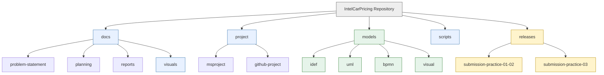
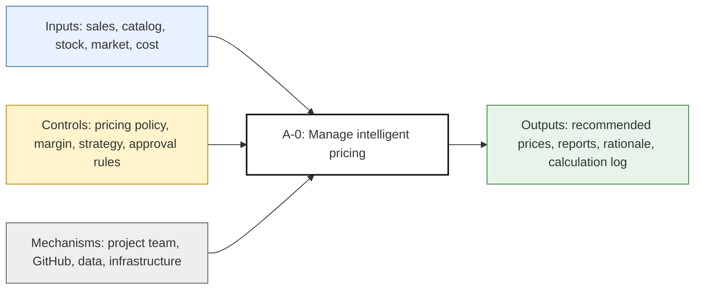
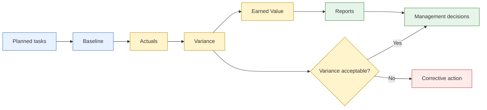

# Project Dashboard

## Project

**Intelligent pricing for automotive products**

## Management scheme

## Practice roadmap

## Artifact structure

## IDEF0 project context

## Baseline and actuals control

## Completion state

| Block | Status |
|---|---|
| Practice 01 | Done |
| Practice 02 part 1 | Done |
| Practice 02 part 2 | Done |
| Practice 03 | Done |
| Visual dashboard | Added |
| README visualization | Added |