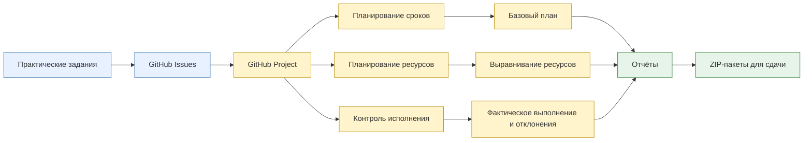
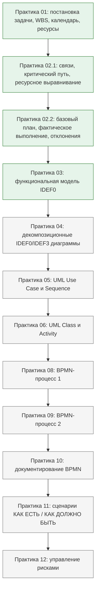
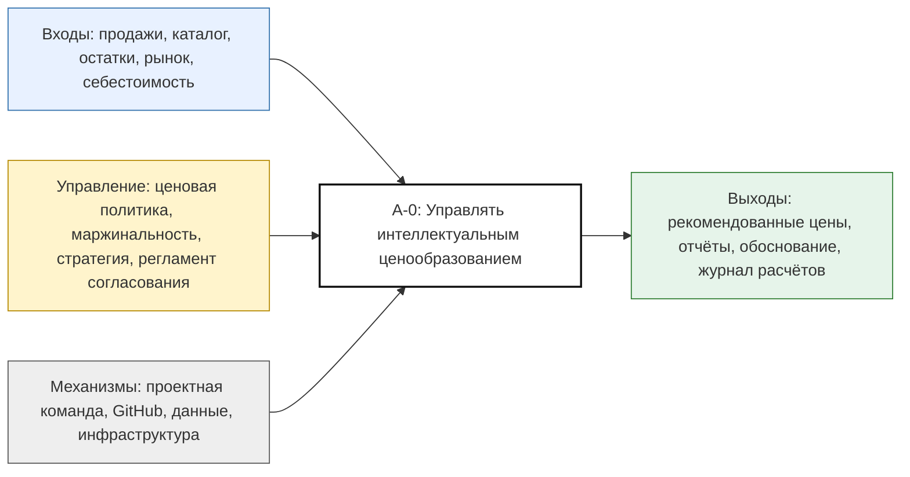
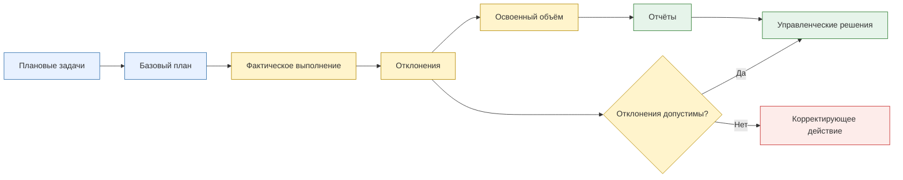

# Визуальная панель проекта

## Проект

**Интеллектуальное ценообразование на автомобильную продукцию**

## Управленческий контур

## Дорожная карта практических работ

## Структура артефактов

```mermaid
flowchart TD
    R["Репозиторий IntelCarPricing"]
    R --> D["Документы"]
    R --> P["Проектное планирование"]
    R --> M["Модели"]
    R --> S["Скрипты"]
    R --> Rel["Пакеты сдачи"]

    D --> PS["Постановка задачи"]
    D --> PL["Планирование"]
    D --> Rep["Отчёты"]
    D --> Vis["Визуальный слой"]

    P --> MSP["MS Project / CSV / XML"]
    P --> GHP["GitHub Project"]

    M --> IDEF["IDEF-модели"]
    M --> UML["UML-модели"]
    M --> BPMN["BPMN-модели"]
    M --> Visual["Визуальные схемы"]

    Rel --> Sub01["Практики 01-02"]
    Rel --> Sub03["Практика 03"]
    Rel --> Sub04["Практика 04"]
    Rel --> Sub05["Практика 05"]
    Rel --> Sub06["Практика 06"]

    classDef repo fill:#eeeeee,stroke:#555555,stroke-width:1px;
    classDef docs fill:#e8f1ff,stroke:#2f6fab,stroke-width:1px;
    classDef models fill:#e6f4ea,stroke:#2e7d32,stroke-width:1px;
    classDef release fill:#fff4cc,stroke:#b58900,stroke-width:1px;

    class R repo;
    class D,P,S,Vis docs;
    class M,IDEF,UML,BPMN,Visual models;
    class Rel,Sub01,Sub03,Sub04,Sub05,Sub06 release;
```

## IDEF0-контекст проекта

## Контроль базового плана и фактического выполнения

## Состояние готовности

| Блок | Статус |
|---|---|
| Практика 01 | Готово |
| Практика 02, часть 1 | Готово |
| Практика 02, часть 2 | Готово |
| Практика 03 | Готово |
| Визуальная панель в README | Переведена на русский |
| Визуальная панель проекта | Переведена на русский |
